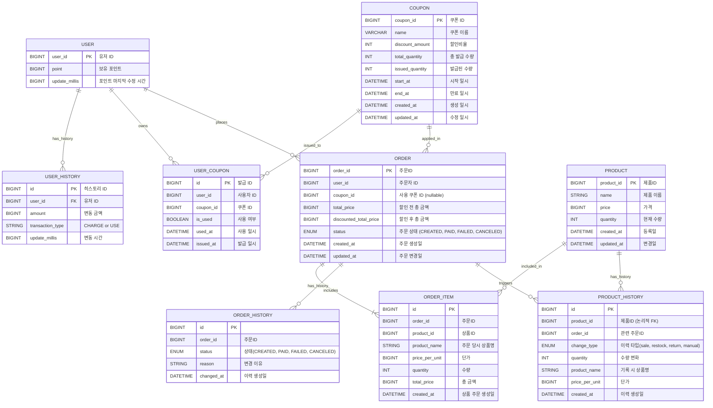

```mermaid    
erDiagram
%% 사용자 및 포인트 관련
    USER {
        BIGINT user_id PK "유저 ID"
        BIGINT point "보유 포인트"
        BIGINT update_millis "포인트 마지막 수정 시간"
    }

    USER_HISTORY {
        BIGINT id PK "히스토리 ID"
        BIGINT user_id FK "유저 ID"
        BIGINT amount "변동 금액"
        STRING transaction_type "CHARGE or USE"
        BIGINT update_millis "변동 시간"
    }

    %% 쿠폰 관련
    COUPON {
        BIGINT coupon_id PK "쿠폰 ID"
        VARCHAR name "쿠폰 이름"
        INT discount_amount "할인비율"
        INT total_quantity "총 발급 수량"
        INT issued_quantity "발급된 수량"
        DATETIME start_at "시작 일시"
        DATETIME end_at "만료 일시"
        DATETIME created_at "생성 일시"
        DATETIME updated_at "수정 일시"
    }

    USER_COUPON {
        BIGINT id PK "발급 ID"
        BIGINT user_id "사용자 ID"
        BIGINT coupon_id "쿠폰 ID"
        BOOLEAN is_used "사용 여부"
        DATETIME used_at "사용 일시"
        DATETIME issued_at "발급 일시"
    }

    %% 주문 관련
    ORDER {
        BIGINT order_id PK "주문ID"
        BIGINT user_id "주문자 ID"
        BIGINT coupon_id "사용 쿠폰 ID (nullable)"
        BIGINT total_price "할인 전 총 금액"
        BIGINT discounted_total_price "할인 후 총 금액"
        ENUM status "주문 상태 (CREATED, PAID, FAILED, CANCELED)"
        DATETIME created_at "주문 생성일"
        DATETIME updated_at "주문 변경일"
    }

    ORDER_ITEM {
        BIGINT id PK
        BIGINT order_id "주문ID"
        BIGINT product_id "상품ID"
        STRING product_name "주문 당시 상품명"
        BIGINT price_per_unit "단가"
        INT quantity "수량"
        BIGINT total_price "총 금액"
        DATETIME created_at "상품 주문 생성일"
    }

    ORDER_HISTORY {
        BIGINT id PK
        BIGINT order_id "주문ID"
        ENUM status "상태(CREATED, PAID, FAILED, CANCELED)"
        STRING reason "변경 이유"
        DATETIME changed_at "이력 생성일"
    }

    %% 상품 및 재고 관련
    PRODUCT {
        BIGINT product_id PK "제품ID" 
        STRING name "제품 이름"
        BIGINT price "가격"
        INT quantity "현재 수량"
        DATETIME created_at "등록일"
        DATETIME updated_at "변경일"
    }

    PRODUCT_HISTORY {
        BIGINT id PK
        BIGINT product_id "제품ID (논리적 FK)"
        BIGINT order_id "관련 주문ID"
        ENUM change_type "이력 타입(sale, restock, return, manual)"
        INT quantity "수량 변화"
        STRING product_name "기록 시 상품명"
        BIGINT price_per_unit "단가"
        DATETIME created_at "이력 생성일"
    }

    %% 관계 정의
    USER ||--o{ USER_HISTORY : has_history
    USER ||--o{ USER_COUPON : owns
    COUPON ||--o{ USER_COUPON : issued_to
    USER ||--o{ ORDER : places
    COUPON ||--o{ ORDER : applied_in
    ORDER ||--|{ ORDER_ITEM : includes
    ORDER ||--o{ ORDER_HISTORY : has_history
    PRODUCT ||--o{ ORDER_ITEM : included_in
    PRODUCT ||--o{ PRODUCT_HISTORY : has_history
    ORDER ||--o{ PRODUCT_HISTORY : triggers

```