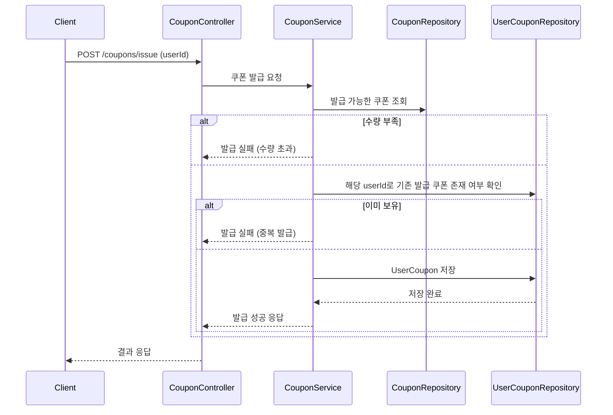

```mermaid

sequenceDiagram

    participant Client
    participant API as CouponController
    participant Service as CouponService
    participant CouponRepo as CouponRepository
    participant UserCouponRepo as UserCouponRepository

    Client->>API: POST /coupons/issue (userId)
    API->>Service: 쿠폰 발급 요청

    Service->>CouponRepo: 발급 가능한 쿠폰 조회
    alt 수량 부족
        Service-->>API: 발급 실패 (수량 초과)
    else
        Service->>UserCouponRepo: 해당 userId로 기존 발급 쿠폰 존재 여부 확인
        alt 이미 보유
            Service-->>API: 발급 실패 (중복 발급)
        else
            Service->>UserCouponRepo: UserCoupon 저장
            UserCouponRepo-->>Service: 저장 완료
            Service-->>API: 발급 성공 응답
        end
    end
    API-->>Client: 결과 응답

```

