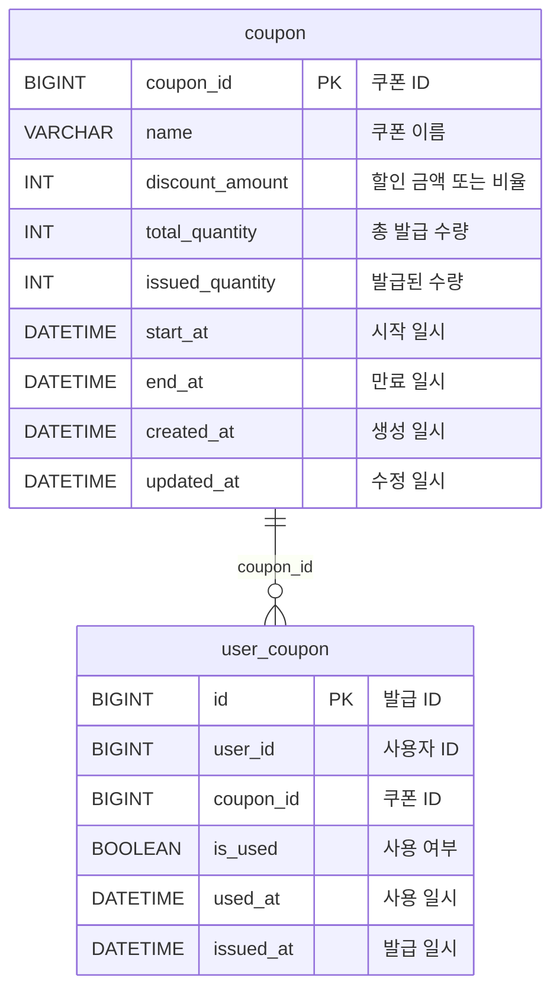

```mermaid
erDiagram

    coupon {
        BIGINT coupon_id PK "쿠폰 ID"
        VARCHAR name "쿠폰 이름"
        INT discount_amount "할인 금액 또는 비율"
        INT total_quantity "총 발급 수량"
        INT issued_quantity "발급된 수량"
        DATETIME start_at "시작 일시"
        DATETIME end_at "만료 일시"
        DATETIME created_at "생성 일시"
        DATETIME updated_at "수정 일시"
    }

    user_coupon {
        BIGINT id PK "발급 ID"
        BIGINT user_id "사용자 ID"
        BIGINT coupon_id "쿠폰 ID"
        BOOLEAN is_used "사용 여부"
        DATETIME used_at "사용 일시"
        DATETIME issued_at "발급 일시"
    }

    coupon ||--o{ user_coupon : "coupon_id"
```