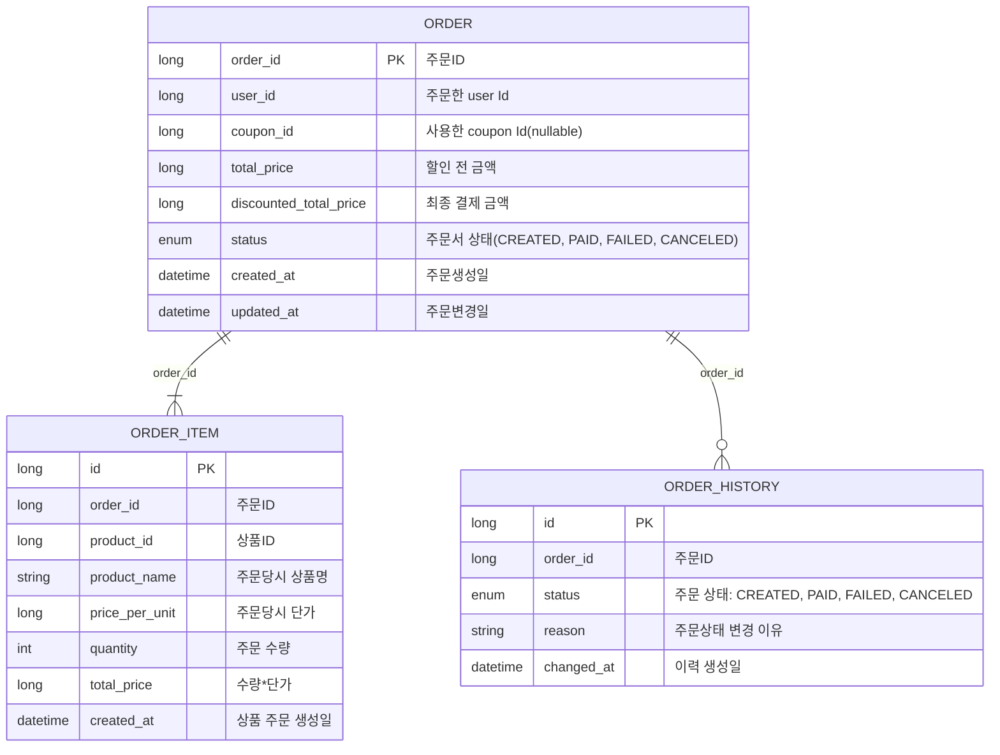

```mermaid
erDiagram

    ORDER ||--|{ ORDER_ITEM : order_id
     ORDER ||--o{ ORDER_HISTORY : order_id


    ORDER {
        long order_id PK "주문ID"
        long user_id "주문한 user Id"
        long coupon_id "사용한 coupon Id(nullable)"
        long total_price "할인 전 금액"
        long discounted_total_price "최종 결제 금액"
        enum status "주문서 상태(CREATED, PAID, FAILED, CANCELED)"
        datetime created_at "주문생성일"
        datetime updated_at "주문변경일"
    }


    ORDER_ITEM {
        long id PK
        long order_id "주문ID"
        long product_id "상품ID"
        string product_name "주문당시 상품명"
        long price_per_unit "주문당시 단가"
        int quantity "주문 수량"
        long total_price "수량*단가"
        datetime created_at"상품 주문 생성일"
    }

    
    ORDER_HISTORY {
        long id PK
        long order_id "주문ID"
        enum status "주문 상태: CREATED, PAID, FAILED, CANCELED"
        string reason "주문상태 변경 이유"
        datetime changed_at "이력 생성일"
    }

```
