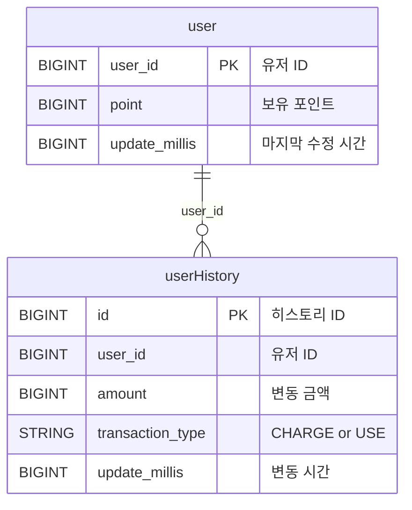

```mermaid
erDiagram
    user {
        BIGINT user_id PK "유저 ID"
        BIGINT point "보유 포인트"
        BIGINT update_millis "마지막 수정 시간"
    }

    userHistory {
        BIGINT id PK "히스토리 ID"
        BIGINT user_id "유저 ID"
        BIGINT amount "변동 금액"
        STRING transaction_type "CHARGE or USE"
        BIGINT update_millis "변동 시간"
    }

    user ||--o{ userHistory : user_id

```
