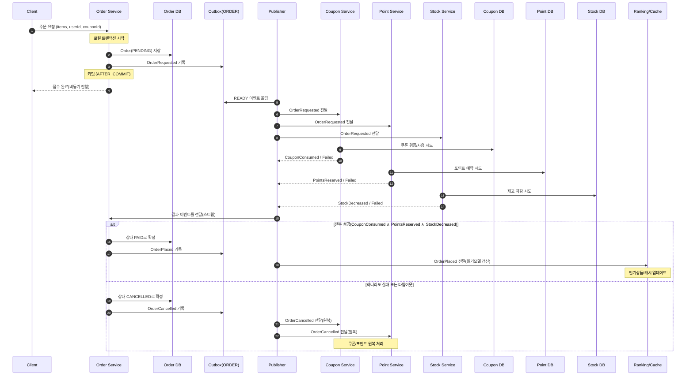

# 서비스 확장 시 트랜잭션 한계와 대응 방안

## 1) 배경
도메인별로 **애플리케이션 서버/DB를 분리**하면 단일 DB의 ACID 트랜잭션으로 전체 업무를 묶을 수 없다.  
예) 주문 1건 처리에 `주문`, `포인트`, `쿠폰`, `재고` 각 DB가 관여.

---

## 2) 한계 (문제 정의)
- **원자성 상실**: 일부 도메인 반영 성공/실패가 갈리며 데이터 불일치 발생.
- **2PC의 운영 복잡성**: 성능 저하·락 홀드·부분장애 취약. 대규모 운영에 부적합.
- **동기 호출 사슬의 취약성**: 지연/장애 전파, 결합도↑, MTTR↑.
- **보정 비용 증가**: 불일치 후 수동/자동 보정 로직·운영 부담 확대.

---

## 3) 대응 방안 (핵심 전략)
- **애플리케이션 이벤트**: 각 도메인이 자가 트랜잭션 커밋 후 **도메인 이벤트 발행**, 타 도메인은 **비동기 구독**해 자체 DB 반영.
- **Outbox 패턴**: 이벤트를 **커밋 내** Outbox 테이블에 기록 → 퍼블리셔가 전송/재시도 → 손실/중복/지연 대응.
- **멱등성 보장**: `eventId` 기반 dedup 테이블로 **at-least-once** 전달을 **exactly-once 효과**로 승격.
- **보상 트랜잭션**: 부분 실패 시 **원복 이벤트**로 상태 되돌림(예: 재고 실패 → 주문 취소, 포인트/쿠폰 원복).
- **최종 일관성 채택**: 강한 일관성 대신 **SLO 내 반영 지연 허용**. 고객 경험 임팩트가 큰 구간은 동기 검증/보상 병행.
- **관찰가능성**: Outbox 적체/지연/실패율, 멱등 드롭율, 보상 트리거 건수 모니터링 및 알림.

---

# 이벤트 기반 분할안 (주문 중심, 최소 설계)

## 1) 목표
- 주문 서비스에서 `쿠폰/포인트/재고/랭킹` **동기 의존 제거**
- 주문은 **로컬 트랜잭션만** 커밋 → 결과는 **이벤트**로 전파/집계 → **최종 일관성**

---

## 2) 이벤트 흐름 (핵심 단계)
1. **OrderRequested** 발행: 주문 DB에 `PENDING` 저장 후 Outbox 기록.
2. **도메인별 처리**: 쿠폰/포인트/재고 서비스가 각자 이벤트 처리 → 성공/실패 결과 이벤트 발행.
3. **주문 확정/취소**: 주문 서비스가 결과 **집계** → 전부 성공 시 `PAID` + **OrderPlaced** 발행, 하나라도 실패/타임아웃이면 `CANCELLED` + **OrderCancelled** 발행.
4. **읽기 모델 갱신**: 랭킹/캐시는 **OrderPlaced**만 구독(확정 건만 반영).

---

## 3) 이벤트 정의(간결)
- `OrderRequested(orderId, userId, couponId, items[], totalPrice)`
- `CouponConsumed / CouponConsumeFailed (orderId, …)`
- `PointsReserved / PointsReserveFailed (orderId, amount, …)`
- `StockDecreased / StockDecreaseFailed (orderId, items[], …)`
- `OrderPlaced(orderId, items[], paidAt)`
- `OrderCancelled(orderId, reason)`

> 모든 이벤트는 공통 엔벨로프(`eventId, occurredAt, traceId, schemaVersion`)와 **멱등 처리** 전제.

---

## 4) 상태 전이 (주문)
```
PENDING --(쿠폰 OK ∧ 포인트 OK ∧ 재고 OK)--> PAID --(OrderPlaced)-->
PENDING --(하나라도 실패/타임아웃)---------> CANCELLED --(OrderCancelled)-->
```

---

## 5) 책임 분리 요약
- **쿠폰**: 사용 가능성/선착순/중복 검증은 쿠폰 도메인의 단독 책임 → `CouponConsumed/Failed`.
- **포인트**: **예약(Reserve)** 후 확정/원복은 `OrderPlaced/Cancelled` 수신 시 처리.
- **재고**: 차감 시도 후 결과 이벤트 즉시 발행(실패 시 빠른 피드백).
- **랭킹/캐시**: `OrderPlaced`만 반영, 임시/실패 거래 제외.

---

## 6) Outbox·퍼블리셔·핸들러 원칙
- **AFTER_COMMIT 기록**: 이벤트는 로컬 트랜잭션 커밋 성공 이후에만 Outbox에 남김.
- **전송/재시도**: READY → 전송 → SENT, 실패 시 지수 백오프·FAILED 격리.
- **멱등 처리**: `eventId+handlerId` dedup 테이블 필수.

---

## 7) 주문 서비스 체크리스트
- [ ] 동기 의존 호출 제거 (`coupon/point/stock` 직접 호출 X)
- [ ] `OrderRequested` 발행 시점: `PENDING` 저장 **커밋 후**
- [ ] 결과 이벤트 3종 집계 로직(타임아웃 포함)
- [ ] 확정 시 `PAID` + `OrderPlaced`, 실패 시 `CANCELLED` + `OrderCancelled`
- [ ] 인기상품 Outbox 적재는 **OrderPlaced 핸들러**로 이동

---

# 주문 시퀀스 다이어그램


