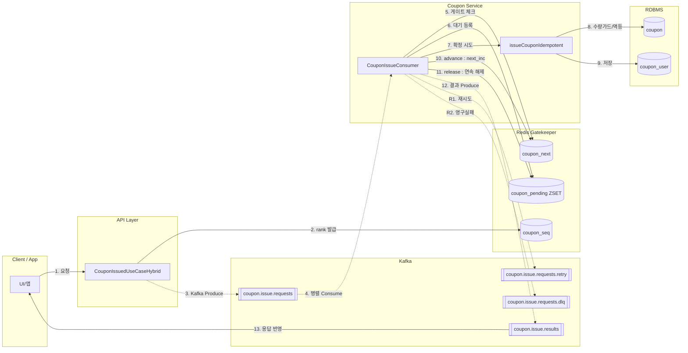
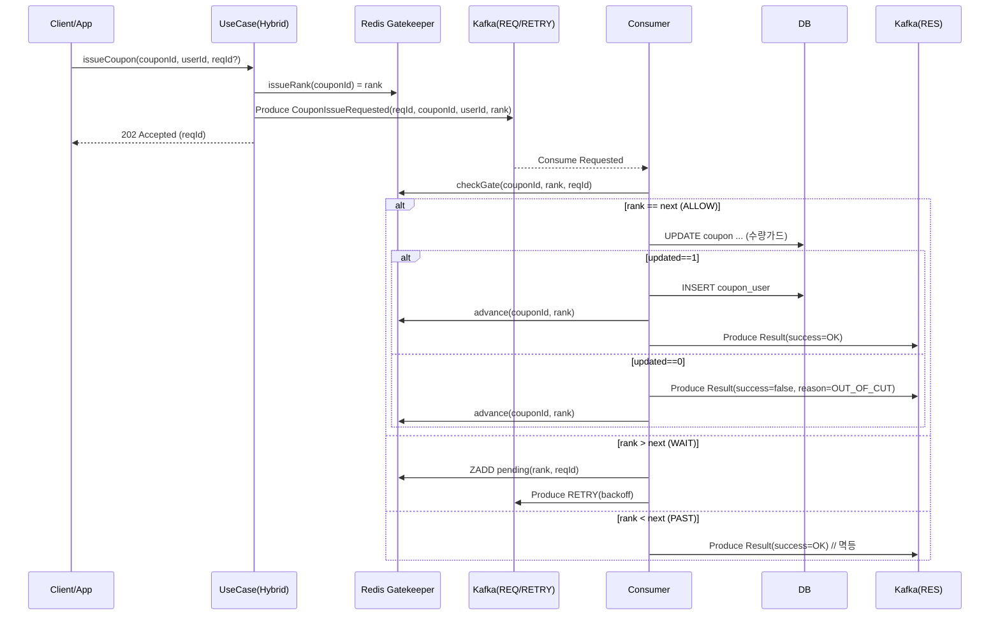
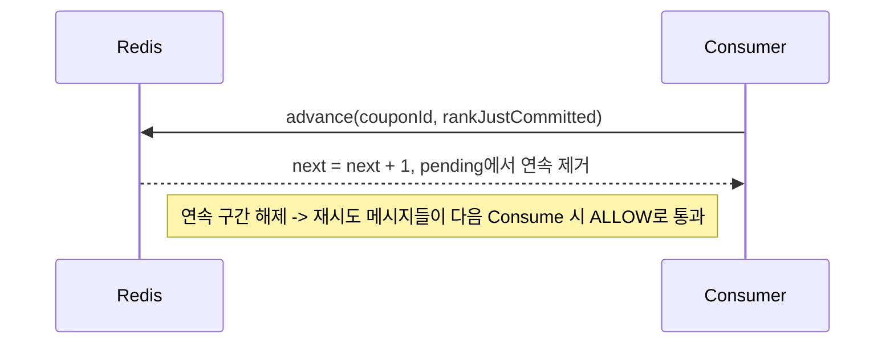

# STEP 18 하이브리드 쿠폰 발급 설계서 (Redis + Kafka, FCFS 보장)

> 목적: **대용량 트래픽**에서도 **엄격한 선착순(FCFS)**을 보장하면서 **확장성**과 **정확성**을 동시에 달성. Redis는 **순번·게이트키퍼**, Kafka는 **버퍼·분산 처리**, DB는 **진실 소스(멱등+수량가드)** 역할을 맡는다.

---

## 1. 요구사항 정리
- 선착순 **N명**에게만 쿠폰 발급(초과 불가, 정확성 필수)
- 대량 동시 요청에서 **처리량** 확보(스케일 아웃)
- **멱등성**: 동일 `reqId` 재전송 시 중복 발급 금지
- **가용성**: 일시 장애/지연 시 **재시도**로 복구
- **관찰성**: 상태 추적(요청 수, 발급 수, 대기열 길이, 실패 사유)

---

## 2. 아키텍처 개요



---

## 3. 컴포넌트 책임
- **UseCase (Hybrid)**: 입력 검증 → **Redis에서 순번(rank) 발급** → `CouponIssueRequested(rank 포함)`을 **Kafka REQ**로 발행 → `reqId` 즉시 응답
- **Redis Gatekeeper**:
    - `issueRank()` : `INCR seq`로 순번 부여(초기 `next=1`)
    - `checkGate(rank, reqId)` : `rank == next`면 **ALLOW**, `rank > next`면 **WAIT**(ZSET에 대기), 그 외 **PAST**
    - `advance(rank)` : 커밋 성공 후 `next++`, `pending` ZSET에서 **연속 구간** 해제
- **Consumer**: 메시지 수신 → 게이트 체크 → ALLOW면 **DB 확정**(수량가드 + 멱등) → advance → 결과 이벤트 발행
- **DB**: 정확성 보장. `coupon`(총량/발급량), `coupon_user`(UNIQUE `(coupon_id, req_id)`, `(coupon_id, user_id)`)
- **Kafka**: 버퍼/분산 처리, 재시도/백오프, DLQ

---

## 4. 카프카 토픽/파티션/키 전략
- `coupon.issue.requests` (요청)
    - **Key**: `couponId + "#" + (hash(reqId) % 8)` → 단일 쿠폰 폭주도 **8 샤드 병렬 소비**
    - 컨슈머 `concurrency`: 32~64
- `coupon.issue.requests.retry` (재시도)
    - Backoff(100ms → 300ms → 1s 등)로 재소비
- `coupon.issue.results` (결과)
    - Key = `reqId` (사용자별/요청별 추적)
- `coupon.issue.requests.dlq` (DLQ)

---

## 5. Redis 게이트 설계
### 키
- `coupon:{cId}:seq` : INCR로 순번 배부(1,2,3,…)
- `coupon:{cId}:next` : 현재 처리해야 할 다음 순번(초기 1)
- `coupon:{cId}:pending` : ZSET(rank → reqId), 차례 안 온 메시지 대기

### Lua 스크립트 (개요)
- **ENTER_SEQ**: `INCR seq`; `next` 미존재 시 `SET 1`
- **GATE_CHECK**: `rank == next` → `ALLOW`; `rank > next` → `ZADD pending` 후 `WAIT`; `rank < next` → `PAST`
- **ADVANCE**: `rank == next` 검증 → `next++` → `pending`에서 **연속 rank** 해제하며 `next` 갱신

---

## 6. DB 스키마/트랜잭션
- `coupon`
    - 칼럼: `id`, `total_quantity`, `issued_quantity`
    - 수량 가드:
      ```sql
      UPDATE coupon
      SET issued_quantity = issued_quantity + 1
      WHERE id = :couponId AND issued_quantity < total_quantity;
      ```
- `coupon_user`
    - UNIQUE `(coupon_id, req_id)` : 재전송 멱등
    - UNIQUE `(coupon_id, user_id)` : 사용자 중복 방지

---

## 7. 시퀀스 다이어그램
### 7.1 요청→확정 전체 흐름

### 7.2 연속 해제(advance) 내부 로직


---

## 8. 예외/재시도/멱등 처리
- **WAIT**: 재시도 토픽으로 Backoff
- **VALIDATION**: 쿠폰 없음/비활성 → 즉시 실패 이벤트
- **OUT_OF_CUT**: 수량가드 실패 → 실패 이벤트 발행 후 advance
- **멱등**: UNIQUE 제약 충돌 시 성공 간주
- **일시 오류**: 예외 전파 → 컨슈머 재시도
- **역직렬화 오류**: DLQ로 이동

---

## 9. 운영/모니터링 포인트
- Redis: `next` 정체, `pending` 길이, `seq` 증가율
- Kafka: 컨슈머 레이턴시, 재시도 건수, DLQ 카운트
- DB: `incrementIssuedIfAvailable` 실패율
- 지표: `coupon_next_lag = seq - next + 1`, `pending_size`, 결과 이벤트 지연

---

## 10. 테스트 전략
1) **정상 대량**: N=10,000 요청 → `rank <= total`만 성공
2) **중복**: 동일 사용자/reqId → 멱등 보장
3) **순서**: `next` 단조 증가 확인
4) **재시도 경로**: WAIT → backoff → ALLOW 확인
5) **장애 내성**: 컨슈머 재시작/Redis 장애 후 복구

---

## 11. 비고
- 순수 Kafka와 Redis를 활용하여 선착순 쿠폰발급만 구현한 추가 API 입니다.
- 쿠폰에 별다른 내용이 없는점 양해 부탁드립니다.
- 학습 내용에 집중하기 위해서 간소화 하였습니다.
---


